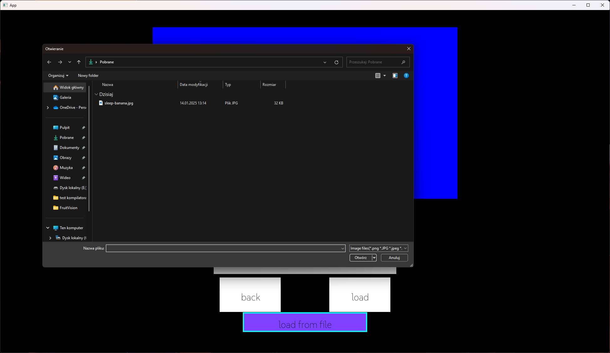

# FruitVision

Application made for predicting fruits.

# How it works?


- ## Select your option




- ## Load your Image/Model


- ## Use file Dialog <sub>(windows only)<sub/>


- ## Predict


## Documentation


## Installation

You have to use python 3.10 , and you should replace "PATH" with python 3.10 path. <sub>(...\Python310\python.exe)</sub>


```cmd
    git clone https://github.com/Slavomir04/FruitVision.git
    cd FruitVision
    mkdir build
    cd build
    cmake .. -G "MinGW Makefiles" -DPython3_EXECUTABLE= "PATH"
    
    mingw32-make
```


    
## License

[MIT](license.txt)

