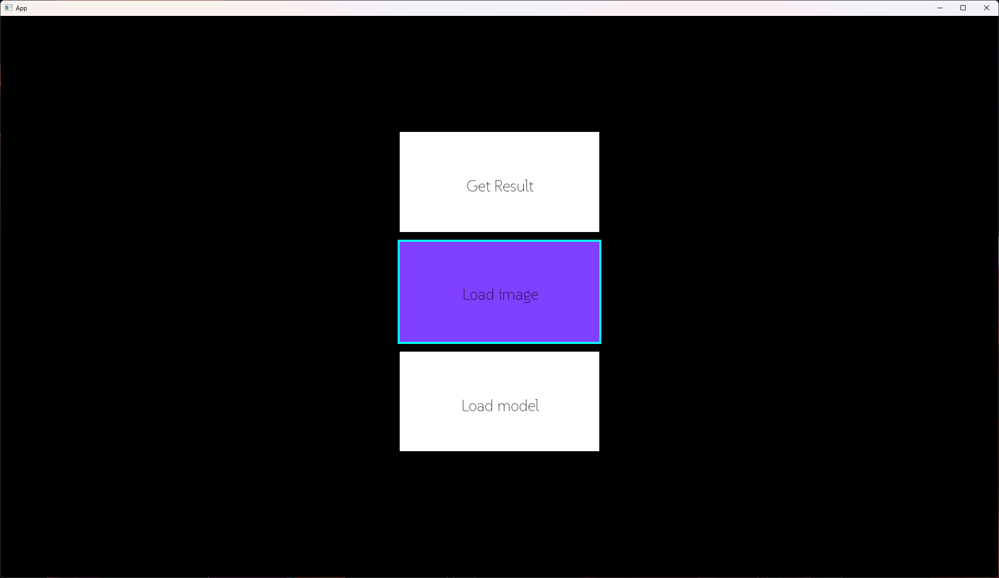
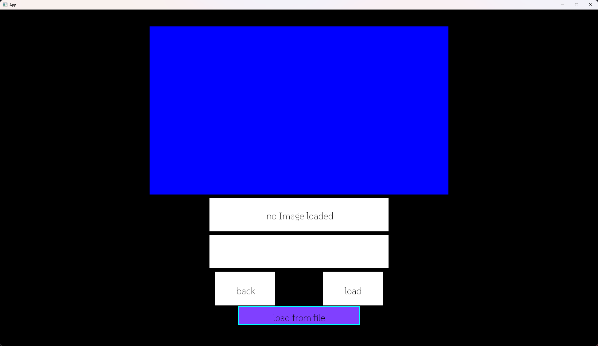
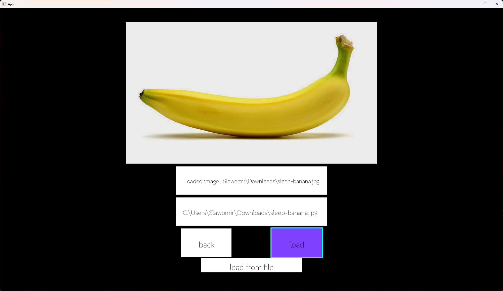

# FruitVision


Application made for predicting fruits.

### Contents:
- [How it works?](#How-it-works?)
- [UML](#UML)
- [Specification](#Specification)
- [Installation Windows](#Installation-Windows)
- [Troubleshoot](#Troubleshoot)


## How it works?

- ### Select your option

<br>

<br>

- ### Load your Image/Model
 <sub>*file Dialog (windows only)*<sub/>

<br>
<br>
<br>
- ### Predict
<br>

- If you want to load model with diffrent categories overide: *src/Resources/categories.txt*
- if you want to translate interface override: *src/Resources/settings.txt*
for example:

| Key  | Polish                | Default                |
| ---- | ----------------------| ------------------------|
| M0   | Predykcja Get Result  | Prediction Get Result   |
| M1   | Zaladuj Obraz          | Load Image              |
| M2   | Zaladuj Model          | Load Model              |
| GR0  | wyniki                 | Results                 |
| GR1  | nieznany eror           | unknown error            |
| GR2  | brak zaladowanego obrazu| no image loaded         |
| GR3  | brak zaladowanego modelu| no model loaded         |
| GR4  | obraz zaladowany        | image loaded            |
| GR5  | model zaladowany        | model loaded            |
| GR6  | wroc                   | back                    |
| GR7  | kliknij po wynik       | click to get result     |
| LI0  | Obraz zaladowany        | Loaded image            |
| LI1  | brak obrazu            | no image loaded         |
| LI2  | bledna sciezka         | wrong path              |
| LI3  | poprawna sciezka        | correct path            |
| LI4  | wroc                   | back                    |
| LI5  | zaladuj                 | load                    |
| LI6  | zaladuj z pliku         | load from file          |
| LI7  | nie mozna otworzyc pliku| cannot open file        |
| LM0  | Model zaladowany        | Loaded model            |
| LM1  | brak modelu            | no model loaded         |
| LM2  | bledna sciezka         | wrong path              |
| LM3  | poprawna sciezka        | correct path            |
| LM4  | wroc                   | back                    |
| LM5  | zaladuj                 | load                    |
| LM6  | zaladuj z pliku         | load from file          |


_*(It does not support unicode)*_

### UML


### Specification

#### Standard C++
 - C++ 20
#### Third party libraries
- cmake https://github.com/Kitware/CMake.git
- SFML 2.6.2 https://github.com/SFML/SFML.git
- Python 3.10  https://github.com/python/cpython.git
- python-dev-tools https://github.com/vpoulailleau/python-dev-tools
- tensorflow 2.18.0 https://github.com/tensorflow/tensorflow.git
- pillow 11.0.0 https://github.com/python-pillow/Pillow.git
- numpy 2.0.2 https://github.com/numpy/numpy.git
- googletest https://github.com/google/googletest.git
#### Platform
- Windows 11 64-bit

#### Features
- Loading images <sub>*.png .jpg*</sub>
- Custom Model Support <sub>*.h5*</sub>
- file Dialog
- User-Friendly Interface
- Easy translation thanks to *.txt* text source

## Installation Windows

#### Requirments:
- git
- cmake
- Recommended: MinGW 13.1.0 64-bit <sub>(other versions supported by SFML 2.6.2 should work as well)</sub>
- Python 3.10


if you struggle with other existing version of python add: _-DPython3_EXECUTABLE= <python 3.10 path>_
```cmd
    git clone https://github.com/Slavomir04/FruitVision.git
    cd FruitVision
    mkdir build
    cd build
    cmake .. -G "MinGW Makefiles"
    mingw32-make
```
## Troubleshoot

If you encounter any issues or if something isn’t working as expected, feel free to reach out here. You can report problems or ask for help by creating an issue on GitHub.

- **GitHub Issues**: [GitHub Issues](https://github.com/Slavomir04/FruitVision/issues)

Please share any problems you face, and I’ll do my best to assist you!


